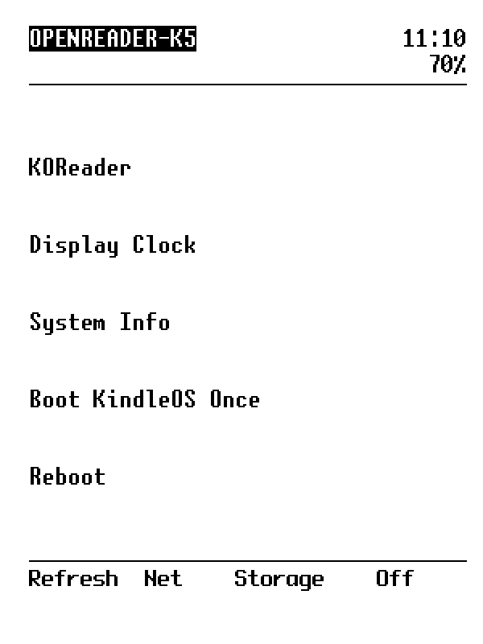
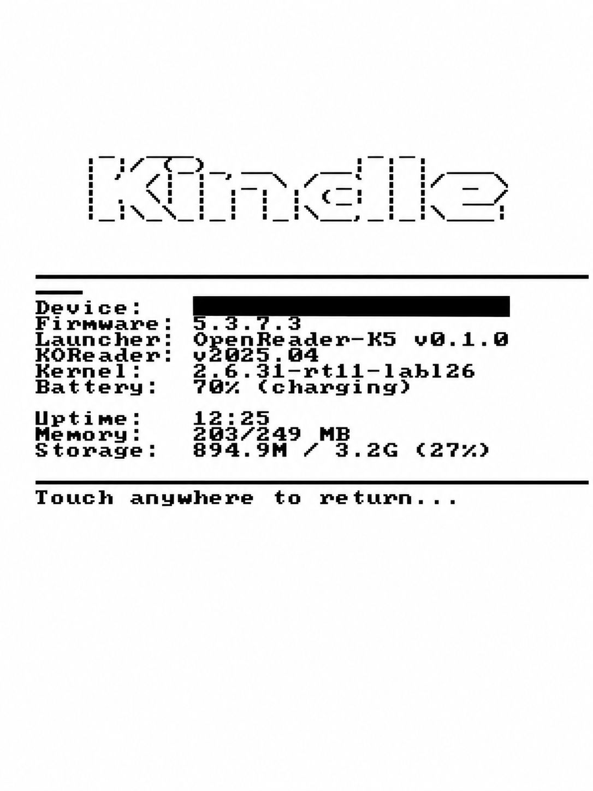

# OpenReader-K5

OpenReader-K5 is a Kindle Touch / K5 adaptation of OpenReader that replaces the normal Amazon user interface after boot and provides a small, purpose-built launcher for KOReader and a few useful device functions.

The K5 port exists because the upstream OpenReader experience on this older Kindle was incomplete: several functions were broken or nonfunctional on the device, while much of the original interface was unnecessary for the intended use. This port strips the environment back to a minimal launcher focused on three things: **reading with KOReader, using the Kindle as a desk clock, and retaining user-selected screensavers**, while still providing a safe way to boot back into KindleOS for maintenance.

This release is intentionally narrow and conservative. It has been tested on one Kindle Touch / K5 running firmware **5.3.7.3** and is designed to refuse installation on unsupported firmware or hardware.

## Status

**Release:** v0.1.2
**Tested device:** Kindle Touch / K5 (`yoshi`)
**Tested firmware:** Kindle 5.3.7.3
**KOReader tested:** v2025.04

The v0.1.2 install, boot, one-shot KindleOS recovery, uninstall, KindleOS fallback, reinstall, and return-to-OpenReader paths have been tested end-to-end on the supported device.

## Tested working

The following functions have been validated on the supported Kindle Touch / K5:

- normal boot directly into OpenReader
- KOReader launch and return to OpenReader
- Display Clock
- System Info
- timed screensaver / sleep and wake recovery
- Wi-Fi connectivity using a network previously configured in KindleOS
- wireless Calibre connection
- USBNetwork mode and return to USB storage
- USB storage mode, safe eject, and return to OpenReader
- Reboot confirmation and reboot
- Power Off confirmation and shutdown
- Boot KindleOS Once and subsequent return to OpenReader
- custom screensaver integration with `linkss`

### Wi-Fi configuration

OpenReader-K5 uses the Kindle's existing Wi-Fi configuration but does **not**
provide an interface for joining or configuring wireless networks.

Set up the Wi-Fi network, password, and related wireless settings in stock
KindleOS first. If those settings need to be changed later, use **Boot
KindleOS Once**, update the Wi-Fi configuration there, and then reboot back
into OpenReader.

Once Wi-Fi has been configured in KindleOS, the tested K5 retains normal
network connectivity under OpenReader and KOReader, including the tested
wireless Calibre connection.


## Screenshots

The screenshots below show the tested K5 interface.







## What OpenReader-K5 does

After the Kindle boots, OpenReader-K5 allows the stock Kindle framework to initialize briefly, then performs a delayed takeover and launches the OpenReader interface.

The launcher provides access to:

- KOReader
- Display Clock
- System Information
- Boot KindleOS Once
- Reboot
- Refresh
- USBNetwork / network controls where supported
- USB storage where supported
- Power off

OpenReader-K5 also includes:

- a boot watchdog
- repeated-boot failure protection
- a one-boot KindleOS recovery mechanism
- wake/redraw handling
- persistent timekeeping support for older K5 hardware
- optional custom-screensaver integration when `linkss` is installed

## Important warning

OpenReader-K5 changes the Kindle boot path.

Before installing it, you should already have:

1. a jailbroken Kindle Touch / K5;
2. working KOReader;
3. working root SSH access to stock KindleOS over USBNetwork;
4. a basic understanding of how to return to KindleOS for maintenance.

**Do not make your first SSH test after installing OpenReader-K5.**

Verify recovery access first.

---


# Requirements

## Required

- Kindle Touch / K5 (`yoshi`)
- Kindle firmware **5.3.7.3**
- an existing jailbreak / root-capable environment
- KOReader installed at:

```text
/mnt/us/koreader
```

The installer expects:

```text
/mnt/us/koreader/koreader.sh
/mnt/us/koreader/fbink
```

## Strongly recommended

- NiLuJe USBNetwork
- verified root SSH access before installation

USBNetwork is not strictly required for the OpenReader runtime itself, but it is strongly recommended as a recovery and maintenance path.

## Optional

- NiLuJe `linkss` for custom screensaver support

---

# Before installing: verify SSH access

OpenReader-K5 changes the Kindle boot path. Before installing it, verify that you can reach **stock KindleOS over USBNetwork and obtain a root SSH shell**.

On the Kindle Touch / K5, NiLuJe USBNetwork can normally be toggled from KindleOS by entering:

```text
;un
```

in the Kindle search bar and submitting the search.

A common USBNetwork configuration uses:

```text
Kindle:   192.168.15.244
Computer: 192.168.15.201
Subnet:   255.255.255.0
```

Use the guide for your host computer:

- **Linux / Ubuntu / Linux Mint:** [`docs/USBNETWORK-LINUX.md`](docs/USBNETWORK-LINUX.md)
- **macOS:** [`docs/USBNETWORK-MACOS.md`](docs/USBNETWORK-MACOS.md)
- **Windows 10/11:** [`docs/USBNETWORK-WINDOWS.md`](docs/USBNETWORK-WINDOWS.md)

The Linux procedure is the configuration used and validated during development of v0.1.2. The macOS and Windows procedures are based on established Kindle USBNetwork guidance but have **not yet been validated by this project**.

Do not proceed with installation until you have a recovery method that you understand and have tested.


---

# Installation

## 1. Boot stock KindleOS

If OpenReader is already installed from development testing, use:

```text
Boot KindleOS Once
```

from the OpenReader menu.

Wait until stock KindleOS is fully booted.

## 2. Enable USBNetwork and connect over SSH

From the KindleOS home screen, enter:

```text
;un
```

in the search bar to toggle USBNetwork on.

Then, for a typical USBNetwork setup on Linux:

```bash
ssh root@192.168.15.244
```

## 3. Copy the release package to the Kindle

Place the release directory somewhere outside:

```text
/mnt/us/extensions/openReader
```

For example:

```text
/mnt/us/openreader-k5-v0.1.2
```

Do not run the installer from inside the active OpenReader installation directory.

## 4. Enter the release directory

Example:

```sh
cd /mnt/us/openreader-k5-v0.1.2
```

## 5. Syntax-check the installer

```sh
sh -n install.sh
echo $?
```

Expected:

```text
0
```

## 6. Run the installer

```sh
sh ./install.sh
```

The installer will:

- verify that it is running as root
- verify Kindle Touch / K5 hardware
- verify firmware 5.3.7.3
- verify the release payload
- verify KOReader and FBInk
- syntax-check release scripts
- back up the existing OpenReader installation if present
- stage the new runtime on `/mnt/us`
- verify the staged runtime
- atomically activate the new runtime
- remount the root filesystem read-write only when required
- install the Upstart configuration
- return the root filesystem to read-only mode
- record installation metadata

The installer does **not** reboot automatically.

## 7. Reboot

When installation finishes successfully:

```sh
sync
/sbin/reboot
```

A normal reboot should enter OpenReader.

---

# One-time KindleOS boot

From the OpenReader menu, choose:

```text
Boot KindleOS Once
```

The next reboot will allow the normal KindleOS interface to start.

OpenReader remains installed.

A later normal reboot will return to OpenReader unless automatic OpenReader boot has been uninstalled.

Internally, the one-shot recovery mechanism uses:

```text
/mnt/us/BOOT_KINDLEOS
```

which is consumed and renamed after use.

---

# Manual one-time KindleOS recovery

If OpenReader is not currently usable but you still have filesystem access, create:

```text
/mnt/us/BOOT_KINDLEOS
```

For example:

```sh
touch /mnt/us/BOOT_KINDLEOS
sync
/sbin/reboot
```

The next boot should allow KindleOS to start normally.

---

# Repeated boot-failure protection

OpenReader-K5 maintains boot-state information under:

```text
/mnt/us/.openreader
```

Relevant files include:

```text
boot-count
boot-failed
```

If repeated OpenReader initialization failures occur before the critical boot sequence completes, the recovery logic is designed to fall back to stock KindleOS rather than loop indefinitely.

---

# Uninstalling automatic OpenReader boot

The v0.1.2 uninstaller disables automatic OpenReader startup but intentionally retains the OpenReader and KOReader files.

## 1. Boot KindleOS once

From OpenReader:

```text
Boot KindleOS Once
```

Wait for stock KindleOS.

## 2. Connect by SSH

```bash
ssh root@192.168.15.244
```

## 3. Enter the release directory

Example:

```sh
cd /mnt/us/openreader-k5-v0.1.2
```

## 4. Syntax-check

```sh
sh -n uninstall.sh
echo $?
```

Expected:

```text
0
```

## 5. Run the uninstaller

```sh
sh ./uninstall.sh
```

The uninstaller removes:

```text
/etc/upstart/openreader-boot.conf
```

but retains:

```text
/mnt/us/extensions/openReader
/mnt/us/koreader
/mnt/us/.openreader
```

It does not reboot automatically.

## 6. Reboot

```sh
sync
/sbin/reboot
```

The Kindle should now remain in stock KindleOS.

---

# Reinstalling OpenReader-K5

While in KindleOS:

```sh
cd /mnt/us/openreader-k5-v0.1.2
sh ./install.sh
```

Then:

```sh
sync
/sbin/reboot
```

OpenReader should return.

---

# Installation backups

Each installation creates a timestamped backup under:

```text
/mnt/us/openreader-k5-backups/
```

For example:

```text
/mnt/us/openreader-k5-backups/20260920-222000
```

The installer records the most recent backup path in:

```text
/mnt/us/.openreader/installation-backup
```

and the installed OpenReader-K5 version in:

```text
/mnt/us/.openreader/openreader-k5-version
```

---

# OpenReader interface

The v0.1.2 launcher currently includes:

```text
KOReader
Display Clock
System Info
Boot KindleOS Once
Reboot
```

with lower toolbar actions for:

```text
Refresh
Net
Storage
Off
```

Some toolbar functions depend on optional packages such as USBNetwork.

---

# Display Clock

The Display Clock provides a full-screen landscape clock.

It is designed to:

- rotate the framebuffer temporarily
- show the current time and date
- keep the display active while the clock is shown
- return to the main OpenReader interface on touchscreen input

---

# System Info

System Info reports information including:

- device
- firmware
- OpenReader-K5 version
- KOReader version
- kernel
- battery
- uptime
- memory
- storage

---

# Timekeeping on Kindle Touch / K5

Older Kindle Touch hardware may lose correct civil time after a hard reset or full power loss.

OpenReader-K5 includes a lightweight timekeeper that stores a last-known valid epoch under:

```text
/mnt/us/.openreader/last-known-epoch
```

The saved timestamp can be restored during boot if the system clock has fallen back to an obviously invalid or older value.

This is not a network time synchronization service. It is a persistence mechanism intended to prevent the Kindle from returning to very old dates after reset.

---

# USBNetwork and Storage

If NiLuJe USBNetwork is installed at:

```text
/mnt/us/usbnet/bin/usbnetwork
```

OpenReader can expose related network/storage actions.

Availability depends on the USBNetwork configuration already present on the Kindle.

OpenReader-K5 does not bundle USBNetwork.

USBNetwork is separate from Wi-Fi. Wireless network selection and credentials
must be configured in stock KindleOS; OpenReader-K5 uses the existing Kindle
Wi-Fi configuration.

---

# Custom screensavers

If NiLuJe `linkss` is installed at:

```text
/mnt/us/linkss
```

OpenReader-K5 can initialize the existing custom screensaver mount.

OpenReader-K5 does not bundle `linkss`.

---

# Host operating system support

The Kindle-side installer and runtime are host-independent. Host setup is only required for USB networking, SSH, and file transfer.

The v0.1.2 development workflow was tested from Linux. Separate Linux, macOS, and Windows USBNetwork guides are provided under [`docs/`](docs/); macOS and Windows instructions should be treated as unvalidated until confirmed on real systems.


# Known limitations

## Device support

v0.1.2 is intentionally restricted to:

```text
Kindle Touch / K5
Firmware 5.3.7.3
```

Other Kindle models and firmware versions are not currently supported by this installer.

Do not bypass the hardware or firmware checks unless you are actively porting and debugging the project.

## KOReader is not bundled

KOReader must already be installed.

## Jailbreak is not provided

OpenReader-K5 is not a jailbreak and does not attempt to exploit or unlock the Kindle.

The Kindle must already provide the necessary root/jailbreak environment.

## USBNetwork is not bundled

SSH/recovery instructions assume that the user has separately installed and configured a compatible USBNetwork package.

## Timezone handling

The tested K5 environment uses the Kindle's existing timezone configuration. On older firmware this may be a fixed UTC offset rather than a modern DST-aware timezone database.

---

# Recovery checklist

If OpenReader does not start as expected:

1. Try the one-shot KindleOS recovery marker:

```sh
touch /mnt/us/BOOT_KINDLEOS
sync
/sbin/reboot
```

2. Boot KindleOS.

3. Connect over SSH:

```bash
ssh root@192.168.15.244
```

4. Inspect:

```sh
cat /mnt/us/.openreader/boot-count 2>/dev/null
cat /mnt/us/.openreader/boot-failed 2>/dev/null
tail -n 100 /mnt/us/.openreader/debug.log 2>/dev/null
```

5. To disable automatic OpenReader boot, run:

```sh
cd /mnt/us/openreader-k5-v0.1.2
sh ./uninstall.sh
sync
/sbin/reboot
```

---

# File layout

Installed OpenReader runtime:

```text
/mnt/us/extensions/openReader/
```

Main scripts:

```text
bin/boot-replacement.sh
bin/clock-updater.sh
bin/display-clock.sh
bin/openreader-upstart-launch.sh
bin/redraw-openreader.sh
bin/timekeeper.sh
bin/touch-launcher.sh
bin/wake-watcher.sh
bin/touch_reader
```

Boot integration:

```text
/etc/upstart/openreader-boot.conf
```

Persistent state:

```text
/mnt/us/.openreader/
```

Backups:

```text
/mnt/us/openreader-k5-backups/
```

---

# Development notes

The K5 port uses a delayed takeover rather than attempting to replace the earliest boot stages.

The tested boot sequence is:

```text
Kindle boot
→ Amazon framework starts
→ OpenReader Upstart job starts
→ short settling delay
→ OpenReader boot replacement runs detached
→ selected Amazon framework services are stopped
→ OpenReader initializes
→ watchdog and wake handling start
→ launcher becomes active
```

This approach was chosen because it proved substantially more stable on Kindle Touch / K5 firmware 5.3.7.3 than attempting to replace the framework before the device completed its normal early initialization.

---

# Tested v0.1.2 lifecycle

The following sequence has been tested successfully on the supported K5:

```text
existing development installation
→ install v0.1.2
→ boot OpenReader
→ Boot KindleOS Once
→ uninstall automatic OpenReader boot
→ reboot into KindleOS
→ reinstall v0.1.2
→ reboot
→ OpenReader returns
```

The installed runtime was compared byte-for-byte against the release payload during validation.

---

# License

OpenReader-K5 preserves the OpenReader project's MIT licensing.

See:

```text
LICENSE
```

in the installed OpenReader directory for the license text.

---

# Credits

OpenReader-K5 is based on the OpenReader project by `terpinedream`.

This K5 port also depends on or interoperates with software from the Kindle homebrew community, including:

- KOReader
- FBInk
- NiLuJe USBNetwork
- NiLuJe `linkss`

Those projects remain separate and are not bundled unless explicitly stated.

---

# Version

```text
OpenReader-K5 v0.1.2
Kindle Touch / K5
Firmware 5.3.7.3
```
